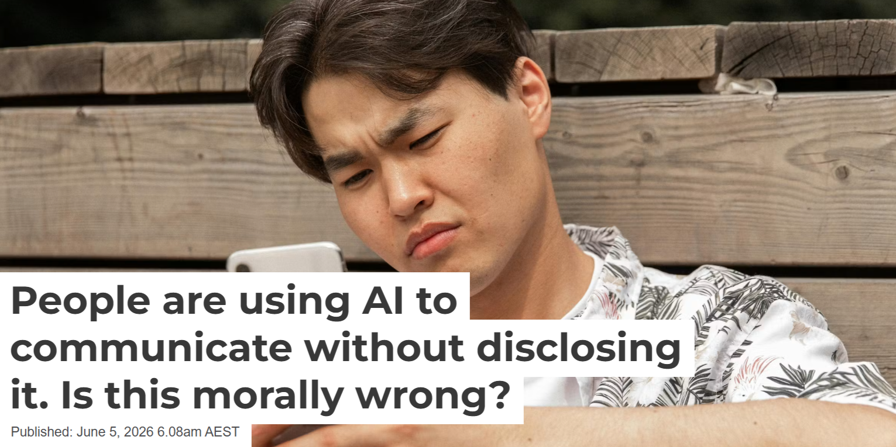
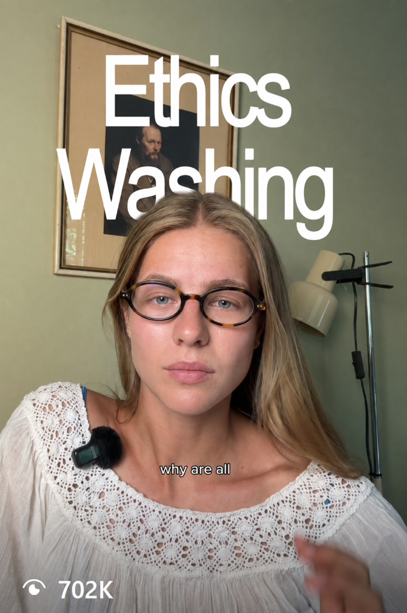
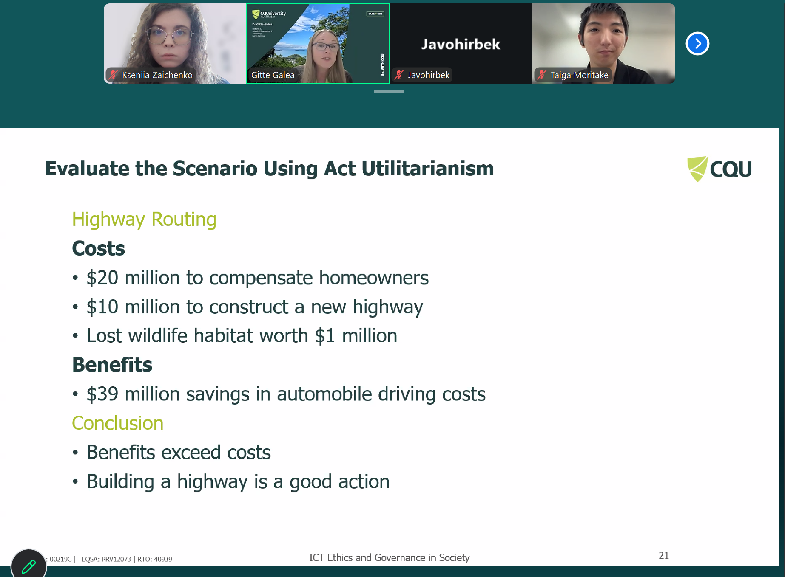

## Artefact 1: Privacy in the Context of ICT Ethics

https://www.youtube.com/watch?v=xSPRouBvgFE

### Summary of the artefact
In the video, Véliz (2025) examines privacy as protecting people from abuses of power, which contradicts the popular notion that privacy is purely about protecting personal data. Véliz cites historical examples of how government-collected information has been used to persecute people and explains why digitalisation can enhance surveillance. I was struck by the author's emphasis that technology is not neutral, and therefore its development requires conscious ethical decisions, even though many of us (like me in the past) think of technology as simply technology (as in the well-known example of a knife. A knife isn't a bad thing simply because it can cause harm).

### Justification on why I chose the artefact
I chose this artefact because it left me fascinated and concerned, as the key takeaway for me was that technology is not neutral.  The author tells us that when we turn the analog into the digital, we make something that wasn't trackable trackable, searchable, and tagable (Véliz 2025). I find this an engrossing problem for humanity:  at this point in time, we are not only dependent on the technology ourselves, but we are also very vulnerable because of it, trackable, searchable, and tagable. Before watching the video, I mostly thought about technology in terms of what it allows us to do. Afterwards, I started thinking about what technology allows others to do to us. I realised that ethics in ICT is also about considering the power that technology creates and that "design is about ethics and ethics is nothing above and beyond very good design" (Véliz 2025).

## Artefact 2: A News article I found this week

https://theconversation.com/people-are-using-ai-to-communicate-without-disclosing-it-is-this-morally-wrong-283773

### Summary of the artefact

The article by Sahebi and Montefiore (2026) explains three forms of deception by AI or robots through two simple real-world examples: using AI to clean up the notes for your work and using AI to write a eulogy. The article explains that AI cloaking can mislead people through External-state deception (a person creates a false impression of what happened), Superficial-state deception (a person creates a false impression of their abilities or qualities), and Hidden-state deception (a person hides abilities, thoughts, or feelings that they actually possess).

### Justification on why I chose the artefact
The article spoke to me as it asks one of the most important questions in AI and IT ethics: what false impression of you, your feelings, abilities, or efforts will another person form if you hide the use of AI? It also touches on the limitation of Kantianism discussed in the workshop, as context can sometimes justify non-disclosure of AI, whereas Kant's strict duty to tell the truth leaves little room for exceptions. The idea of using AI to write a mother's eulogy struck a deep chord. Not only did I learn about the three forms of deception by AI or robots, but I also began to consider the abuse of AI beyond academic or corporate contexts. It is wrong to take credit for work done by an AI, but can an AI-generated eulogy for a mother be considered disrespectful to the deceased? For society, in my view, this means that in the future the covert use of AI could weaken trust in human communication, as people will no longer be able to reliably regard messages as reflecting the sender's thoughts, feelings, and efforts. Perhaps we, as a society, will need to develop contextual norms for AI disclosure, distinguishing between simple language assistance and full content generation. And each person will then need to decide for themselves how to use AI, if at all.

## Artefact 3:  A short video I found this week

https://www.instagram.com/reel/DYHaPEgNUYk/?igsh=MXYzcjRrbjRneGw5Yg==

### Summary of the aretfact
The reel by Aunevik (2026) disputes how technologies designed to simplify life influence human behaviour and autonomy. I was interested in the reference to Henry David Thoreau and his idea that people can become "tools of our tools.", as  (need to finish). The author gives several examples of situations where people become tools of their tools, the most important of which for me is the use of AI agents to perform their work. Although the video focuses on AI and its relationship to reality, the author also raises the issue of the ethics of technology in the context of phones. "Phones were supposed to give us freedom, but now we rely on them," which is a very complex ethical question that everyone must answer for themselves: "Do technologies remain tools that serve people, or are convenience and automation gradually making people dependent on the systems they create and helpless without them?

### Justification on why I chose the artefact
I chose this artifact because it connects directly to Week 4 content, which examines Virtue Ethics and the question of what qualities and habits a person needs for a good life. The video asks a very similar question: does technological progress truly make our lives better, or just make them more convenient? Furthermore, according to Kantanism, human dignity lies in being rational and autonomous. This particular video made me think about whether most people are autonomous today and how I feel about it. As a teenager, I vehemently criticised people who said my generation couldn't achieve anything without technology, and now I see more and more confirmation of their words. If you took a random sample of people aged 18 to 25 and left us in the woods, would we survive without the internet, AI, social media, food delivery, and instant dopamine? I fear that, for society, this implyes technology gives us greater capability while making us less capable without it.

## Artefact 4: Workshop Personal Reflection

**Workshop Week 4, 4 August 2026. Tutor: Gitte Galea. Online Campus**

## Proof of attendance

### Summary of the artefact: My Personal Reflection
This week, I learned about Act Utilitarianism. Although I already knew the other ethical theories discussed in the workshop and had even seen Act Utilitarianism in action, I had never come across its direct definition. Galea (2026) explains that this calculus forces us to blindly "assume the reliability of the data". Later, during the class discussion on how easily these ethical calculations can fall apart in the real world because we “cannot predict consequences with certainty” (Galea 2026), I realised that although we may all hope to maximise happiness, our judgement will always be influenced by our own assumptions and limited understanding of what others consider beneficial, which left me perturbed.

### Justification on why I chose the artefact
I included this screenshot because Act Utilitarianism remains one of my main rules of thumb for everyday problems; I just did not know it had a name. I’m a creature of logic and a little too empathetic to get involved every time and stay cold-headed, so now I also know about the possible downsides of such an approach, based on the example shown on the screen. I tend to be egoistic, if not ignorant, when it comes to my problems or my family’s. So not judging everything through the same lens remains a challenge.

## References in CQU Harvard Style

Aunevik, V [var.aunevik] 2026, Are we becoming the Tools of our Tools?, social media post, 9 May, viewed 9 August 2026, https://www.instagram.com/reel/DYHaPEgNUYk/?igsh=MXYzcjRrbjRneGw5Yg==

Galea, G 2026, Week 4 Lecture: Ethics and Ethical Theories, COIT11223: ICT Ethics and Governance in Society, CQUniversity, viewed 4 August 2026, http://moodle.cqu.edu.au

Sahebi, S & Montefiore, T 2026, ‘People are using AI to communicate without disclosing it. Is this morally wrong?’, *The Conversation*, 5 June, viewed 6 August 2026, https://theconversation.com/people-are-using-ai-to-communicate-without-disclosing-it-is-this-morally-wrong-283773

Véliz, C 2025, How privacy can save your life | Carissa Véliz | TEDxPorto, video, 12 October, viewed 9 August 2026, https://www.youtube.com/watch?v=xSPRouBvgFE
